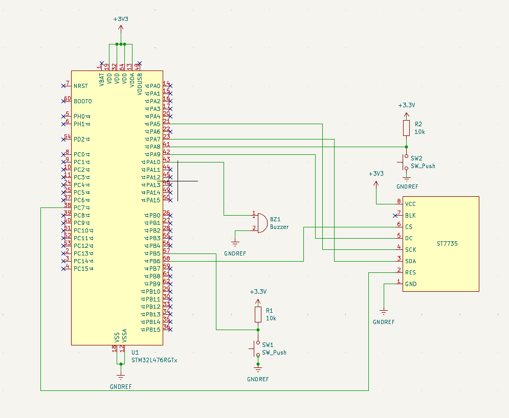

<p align="center">
  
</p>
<p align="center">
  
  
  
  
  
  
</p>

# Study Pet: Embedded Study Companion)

This is a tamagotchi style embedded productivity companion that tracks your focus via app usage in real time and visualizes pet health on an LCD display. When you stay focused, the pet's health recovers, and its mood will increase. When you get distracted, the pet's health declines, triggering worse mood overtime and triggers a buzzer. The point is to make distraction visible instead of invisible, and staying focused a more engaging activity.

This is a **fully solo project**. I designed, implemented, and integrated every part of this system:

- Hardware: component selection, wiring, circuit design
- STM32 firmware: interrupts, state machines, timing, display
- PC-side Python application: app detection, classification, debouncing, UART protocol
- UI logic and pet behavior model
- All pixel art and animation frames for the pet sprites
- Integration across USB-UART, SPI display, and EXTI inputs

## Why I built this
I noticed that I easily get distracted while studying without being aware how much time I can waste through little distractions that add up. I wanted a system that logs distraction episodes and time spent off-task, then reflects that behavior back to me through a simple virtual pet. My goal is awareness and behavior feedback as motivation, not perfect productivity. 

## Demo Video
[](https://www.youtube.com/watch?v=fctF_XBpPNI)

## Hardware
### Circuit Schematic
<p align="center">
  
</p>

### Components
- STM32 NUCLEO-L476RG
- 1.44” ST7735 LCD (SPI, 128×128)
- 2 buttons (EXTI interrupts)
- Active buzzer
- Breadboard
- jumper wires
- USB cable

### Display Wiring 
- `CLK`  → `PA5`  (D13)
- `MOSI` → `PA7`  (D11)
- `CS`   → `PB6`  (D10)
- `DC`   → `PA9`  (D8)
- `RES`  → `PC7`  (D9)

## What it does
- **PC-side focus detection (Python):**
  - Polls the foreground application (Windows OS)
  - Classifies curernt app into **FOCUSED / DISTRACTED / UNKNOWN**
  - Debounces changes with a grace period
  - Sends state changes over UART
  - Adjustable poll interval, grace period, focused and distarcted app lists
 
  - Uses:
    -  `win32gui`, `win32process`, `psutil`
    - `pyserial`

- **STM32 embedded firmware:**
  - UART RX interrupt + line parser, packets are simple text lines terminated by `\n`: `"FOCUSED\n"` or `"DISTRACTED\n"`
  - Session finite state machine:
    - `MENU → FOCUSED/DISTRACTED → END`
    - `entering IDLE pauses session, exiting resumes`
  - Tracks:
    - Focused time (ms)
    - Distracted time (ms)
    - Distracted episodes (count)
    - Pet health (0-100)
  - Pet model:
    - Health regenerates during focused time (+.5 per cycle)
    - Health decays during distracted time (-5 per cycle)
    - Mood thresholds: `HAPPY (70+) / NEUTRAL (30-70) / SAD (1-30) / DEAD (0)`
  - UI:
    - Renders stats + pet animations on ST7735 (SPI LCD) depending on pet mood and session state
  - Alert behavior:
    - While in the **DISTRACTED** state, the buzzer is triggered **continuously** as long as the user is distracted
    - The buzzer stops immediately when the system returns to **FOCUSED**, **IDLE**, **MENU**, or **END**
    - This creates persistent negative feedback tied to distraction duration, making it impossible to ignore when focus is lost. The continuous buzzing encourages the user to re-engage with their task in order to silence the alert.

## High-level architecture
Computer (Python)
- Detect foreground app → classify state → debounce → send UART text ("FOCUSED" / "DISTRACTED")

STM32 (USB-UART)
- UART RX interrupt
- line parsing
- session FSM (MENU/FOCUSED/IDLE/END)
- timers + episode counting
- pet health + mood selection
- ST7735 display + sprite animation

Button Inputs
- Buttons are handled via EXTI interrupts + debounce
- Top button (PA8) cycles through `MENU → FOCUSED/DISTRACTED → END`
- Bottom button (PB5) toggles `IDLE` and `FOCUSED/DISTRACTED`

## How to run
### 1) Flash STM32 firmware
- Build and flash using STM32CubeIDE / STM32CubeMX project
- Ensure UART is configured at **115200 baud**

### 2) Run Python script
- Install deps:
  ```bash
  pip install pyserial psutil pywin32

- Verify COM port in script
  - This is the USB the MCU should be connected to, `SERIAL_PORT = "COM3"` for me.
 
- Run:
  ```bash
  python detect_app.py
